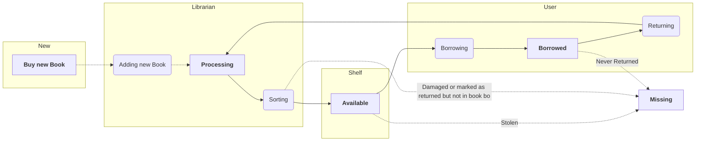
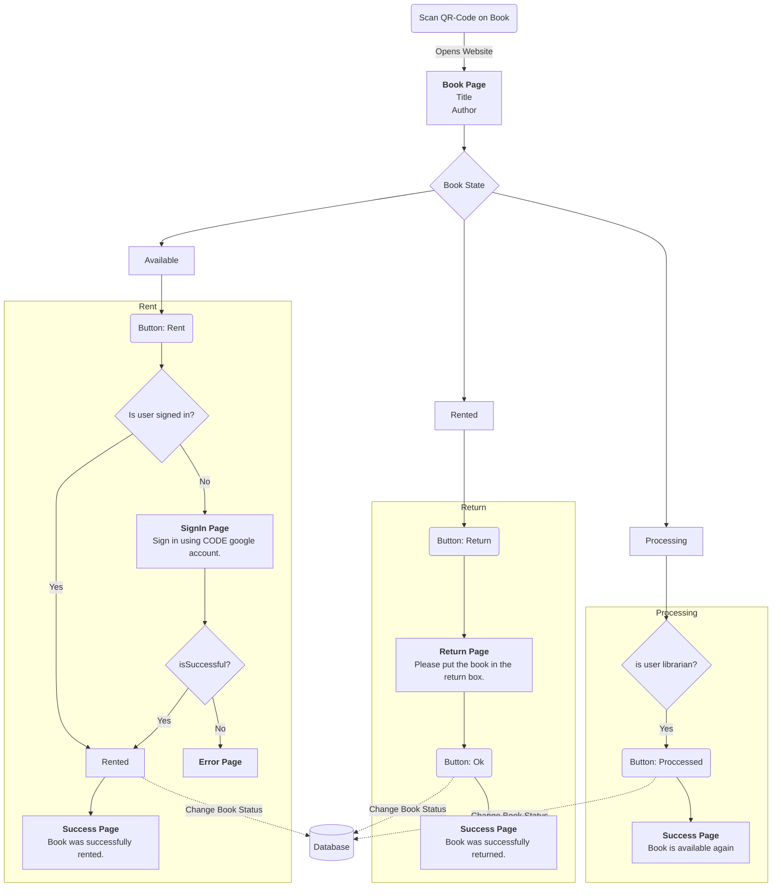
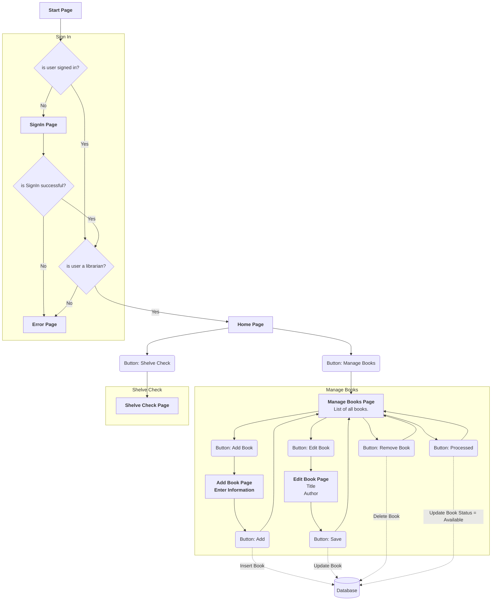
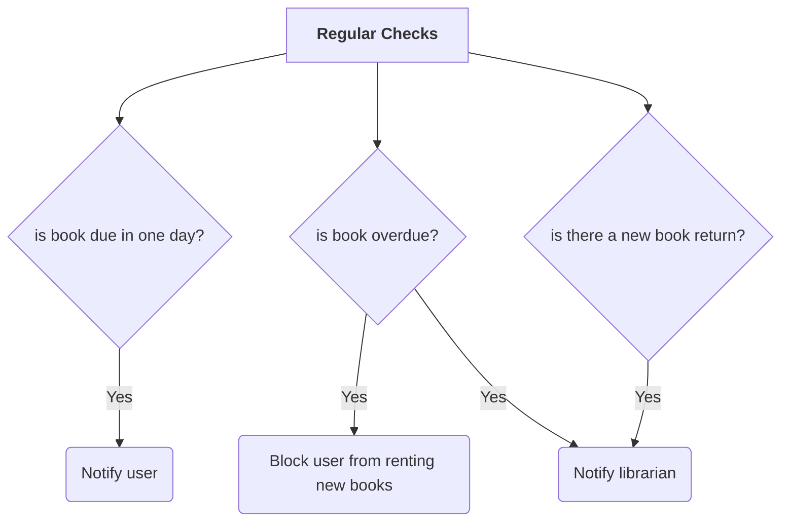

# Flowcharts

# Book Life-cycle

# User Website

# Librarian Website

- last returned
- last borrowed book
- how many books need to be processed
- books that are overdue
- extend the borrowing time of a book

# Server

