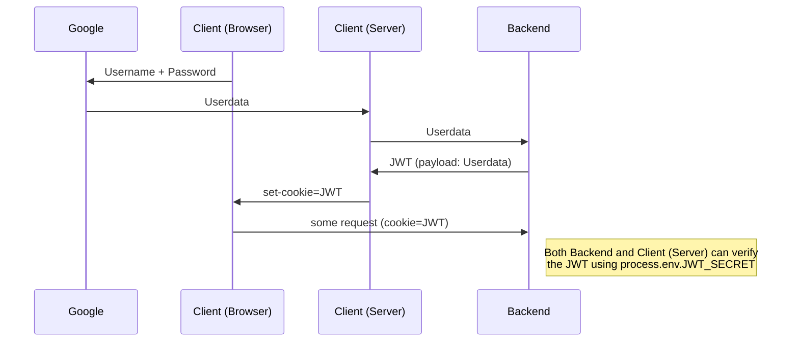

# Documentation

| Technology | Description | code-library-client | code-library-server | code-library-perms |
| --- | --- | --- | --- | --- |
| Docker |  | X | X |  |
| Typescript | strictly typed superset of javascript (i.e. it compiles to javascript). offers advantages in development through improved linting and catching bugs at build time | X | X | X |
| GraphQL - ApolloJs | language- and transport-agnostic standart for building self-documenting and efficient apis. implemented via @apollo/client in code-library-client and via apollo-server in code-library-server. further reading at https://graphql.org/ | X | X |  |
| JWT - JsonwebtokenJs | json web tokens (jwt) are a standart for verifying the issuer of a json payload using a private secret, we are using jsonwebtokenJs for the implementation. further reading at https://jwt.io/ | X | X |  |
| JestJs | Used for unit testing |  |  | X |
| MongoDb - MongooseJs | mongoDb is one of the most popular nosql-databases. we decided to use it over a relational database for shits and giggles and are interacting with it via the ORM mongooseJs. |  | X |  |
| NextJS | we decided to go with this server side rendering react framework for SEO, speed, increased backwards compatibility, and its built-in routing | X |  |  |
| Next-AuthJs | used for google authentication, as well as keeping the users jwt token cookie httpOnly while still being able to access it on the nextJs server | X |  |  |
| ReactJs |  | X |  |  |
| ZodJs | schema validation library offering awesome typescript support |  | X |  |
| AxiosJs | a http request library we might use to access external apis, it offers greater backwards compatibility and automatic status code throwing in comparison to the native browser api fetch |  | X |  |
| ChalkJs | used for console.log styling | X | X |  |

### Database Schema

### Authentication Flow

**JWTs in a nutshell:** A JSON payload that is readable by anyone, signed using a secret key.
Using that key, our backend can, later on, confirm that a JWT sent by the user as a cookie is authentic (i.e. signed by our backend), and the payload can thereby be trusted.

### Authorization System

A user has a permissions integer (abbreviated to permsInt in the codebase), which contains 

### Cloud Architecture

All components of our app are running on the cloud. Partially, that was decided based on suggestions from our project consultant, easy automation of recurring tasks, and the fact that we got free credits to use on a few of the big providers. 

Our final choice was [Google Cloud Platform](https://cloud.google.com/gcp?utm_source=google&utm_medium=cpc&utm_campaign=emea-de-all-en-bkws-all-all-trial-e-gcp-1011340&utm_content=text-ad-none-any-DEV_c-CRE_500236788648-ADGP_Hybrid%20%7C%20BKWS%20-%20EXA%20%7C%20Txt%20~%20GCP%20~%20General%23v2-KWID_43700060393213376-kwd-26415313501-userloc_9061135&utm_term=KW_google%20cloud%20platform-NET_g-PLAC_&gclid=Cj0KCQjw_4-SBhCgARIsAAlegrUbWrMqnUJNZtWRGLT5YLxwmOcZpheHAl7ic8ViFIg1FYANy1CYsc0aAp_eEALw_wcB&gclsrc=aw.ds). From its multitude of services, we’re relying on Cloud Run to run our app containers – frontend and backend – while connecting to a MongoDB database provided by [MongoDB Atlas](https://www.mongodb.com/cloud/atlas/efficiency?utm_source=google&utm_campaign=gs_emea_germany_search_core_brand_atlas_desktop&utm_term=atlas%20mongodb&utm_medium=cpc_paid_search&utm_ad=e&utm_ad_campaign_id=12212624524&adgroup=115749704623&gclid=Cj0KCQjw_4-SBhCgARIsAAlegrUoOsZjHArtTUVbK8TML9kbR8Epi-0xnBtWjFlWnVsYPgIYtgbkJ3YaAq39EALw_wcB). Both platforms offer fully managed solutions, which means we don’t have to worry about configuring and provisioning infrastructure for scaling in the future.

Figure 1: CODE Library App architecture diagram

🔗  [Our project on Google Cloud Platform](https://console.cloud.google.com/home/dashboard?project=code-library-343215)

🔗  [Our main database cluster on MongoDB Atlas](https://cloud.mongodb.com/v2/62111a1d0de8a57b27b02e2e#clusters/detail/Cluster0)

🔗  [Billing information on MongoDB Atlas](https://www.mongodb.com/pricing?utm_source=google&utm_campaign=gs_emea_germany_search_core_brand_atlas_desktop&utm_term=mongodb%20atlas%20pricing&utm_medium=cpc_paid_search&utm_ad=e&utm_ad_campaign_id=12212624524&adgroup=115749704623&gclid=Cj0KCQjw_4-SBhCgARIsAAlegrUwM7bx5G50zmcs9GNrkVOSoT8sxClySMN5qgaepQUMlD1YmnOf9nAaApgoEALw_wcB)

### Deployment

We have two environments for deployment on GCP: staging (pre-production) and production. Each one is triggered based on the name of the branch being pushed to the repository.

- Pushes to master will trigger a deployment to the staging environment.
- Creating or updating a pull requests will also trigger deployments to the staging environment.
- Tags prefixed with a "v" (i.e., v1.0.0) will trigger a deployment to the production environment.

[https://code-library-client-swguw3y6sa-ey.a.run.app/](https://code-library-client-swguw3y6sa-ey.a.run.app/)

[https://code-library-client.herokuapp.com](https://code-library-client.herokuapp.com/)/